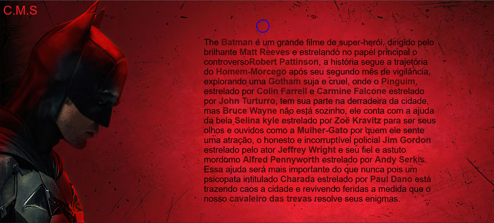
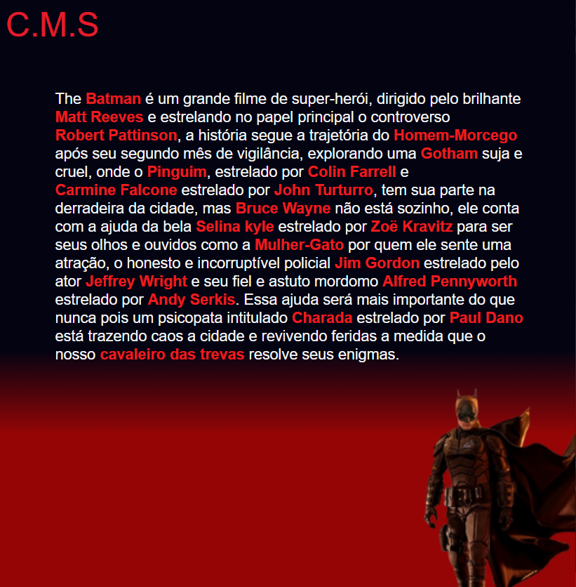
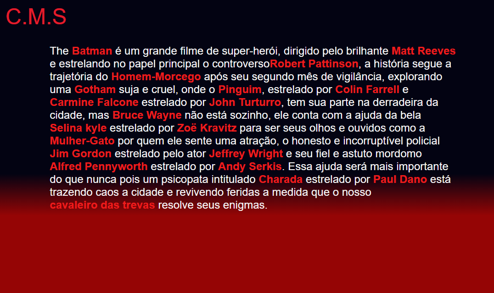

# Cursor Personalizado

## Table of contents

- [Overview](#overview)
  - [The challenge](#the-challenge)
  - [Screenshot](#screenshot)
  - [Solution link](#Solution-link)
- [My process](#my-process)
  - [Built with](#built-with)
  - [What I learned](#what-i-learned)
- [Author](#author)

## Overview

### The objectives

- Explain the plot of the movie the batman, showing who the actors and characters are.

- The layout will have to adapt to each screen size.

- On devices with course the user will be able to see a preview of the image when hovering the mouse over the highlighted words.

### Solution link

[Click here to go to the project](https://christian-m-silva.github.io/cursor-personalizado/)

### Solution video

[Click here to go to the video](https://youtu.be/KaUqwrxMFFs)

### Screenshot

Desktop  

Mobile Portrait 

Mobile Landscape

## My process

### Built with

- Semantic HTML5 markup
- CSS custom properties
- Flexbox
- CSS @media Rule
- JavaScript
- Dom

### What I learned

I learned how I can use JavaScript to capture mouse movement and turn a simple page into a dynamic page, giving the user the power to preview an image for any word highlighted in the project.

## Author

- Name - Christian
- Instagram - [@apredizti](https://www.instagram.com/apredizti/)
- Linkedin - [@Christian Silva]( https://www.linkedin.com/in/christian-silva-83172621a)
- GitHub - [@Christian Silva](https://github.com/Christian-M-Silva)